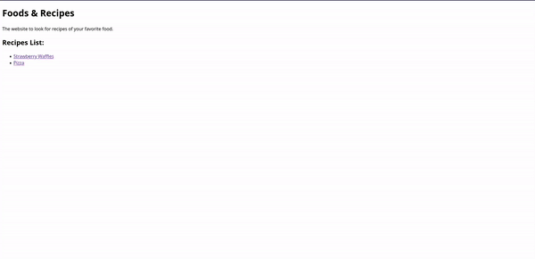

# Task 02

Create a simple website using HTML.

The theme of the website is up to you, in the example below, we created a recipes website.

In the recipes website, we have an index page that contains a list of links to the recipes.

Each recipe has it's own page, and the page contains an image of the meal, the steps and the ingredients.

### Example:

 

---

### Check List:

- The website must contain an index page and at _least_ **two** more extra pages.

- The extra pages must be linked to the index page.

- Each page must have a link that allows us to get back to the index page.

- Use headings `<h1> <h2> ... <h6>`, paragraphs `
`, anchors `<a>`, lists `<ul>...<ol>` & images `` in the website.
